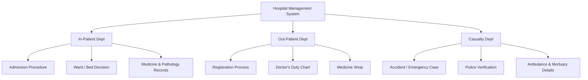
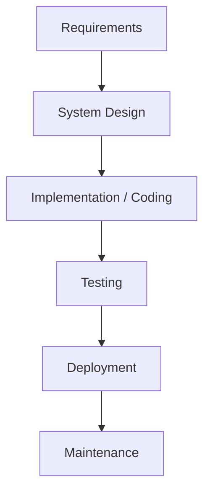
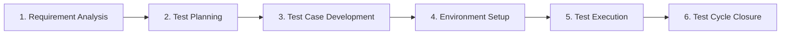
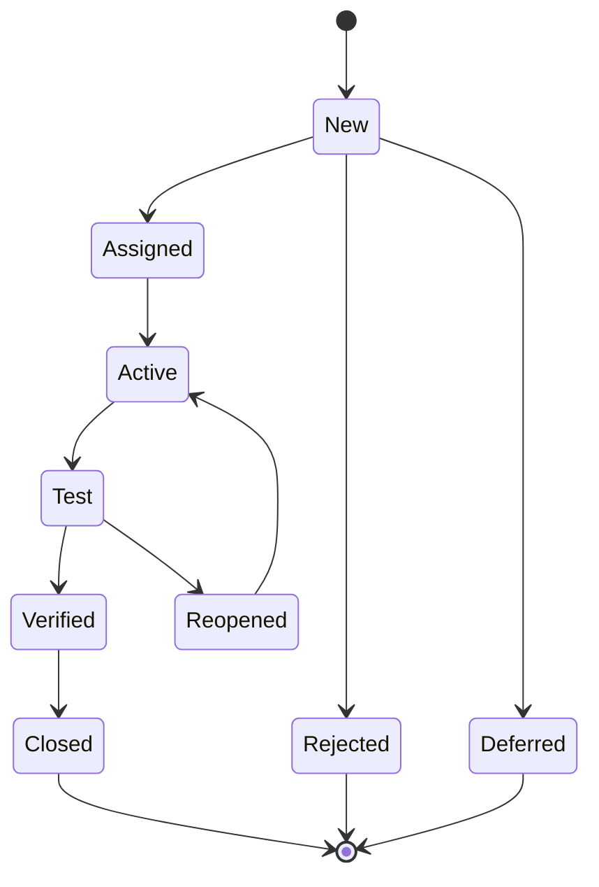
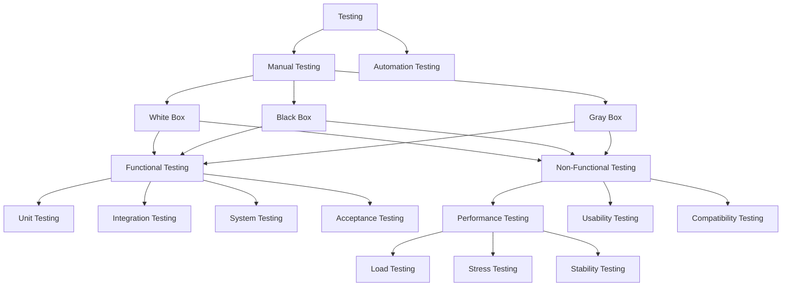
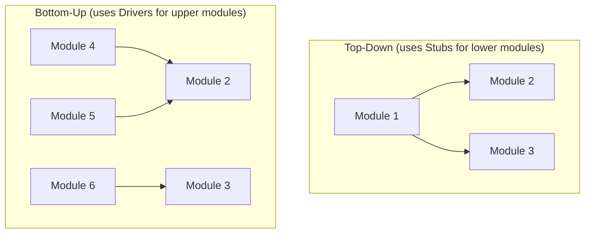
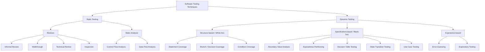
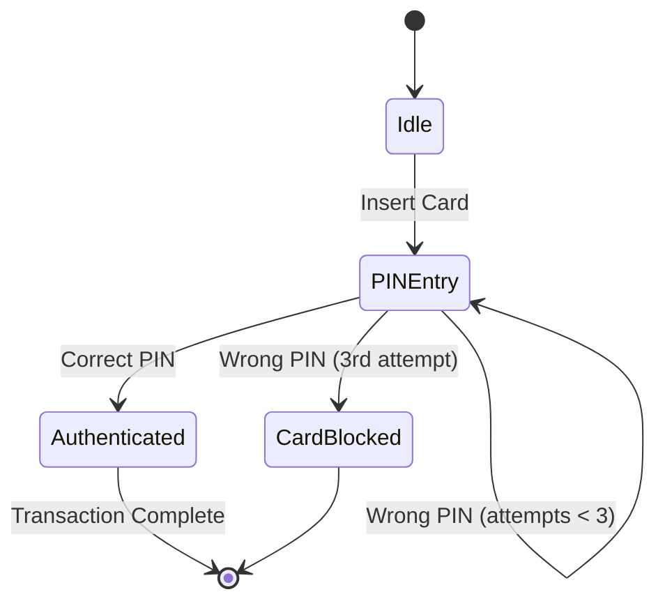
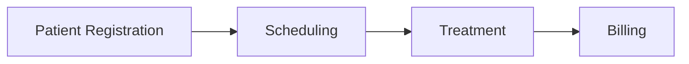

# Software Testing — Exam Preparation Notes

> Consolidated, technically expanded notes covering Units I–V (Fundamentals, Types of Testing, Test Case Development, Testing Techniques, Domain Testing). Concepts from the course slides have been reorganized, corrected, and deepened with standard ISTQB/industry terminology so they hold up under viva/theory questioning, not just recall.

---

## Table of Contents
1. [Unit I — Software Testing Fundamentals](#unit-i--software-testing-fundamentals)
2. [Unit II — Types of Testing](#unit-ii--types-of-testing)
3. [Unit III — Test Case Development](#unit-iii--test-case-development)
4. [Unit IV — Testing Techniques](#unit-iv--testing-techniques)
5. [Unit V — Testing Different Domains](#unit-v--testing-different-domains)
6. [Quick Revision — Short Notes](#quick-revision--short-notes)

---

## Unit I — Software Testing Fundamentals

### 1. System-Level Vocabulary (why testers need it)
Before testing anything, you need to describe *what* you're testing as a system, because test scope and stakeholders fall out of this vocabulary.

| Term | Meaning | Testing relevance |
|---|---|---|
| **System** | An orderly group of interacting components working toward a common goal | Defines total scope of "the software" |
| **Sub-system / Module** | A system decomposed into smaller functional units | Basis for **Unit Testing** boundaries |
| **Environment** | Everything outside the system that supplies input or consumes output (excludes raw material & finished product) | Basis for **environment/compatibility testing** |
| **Boundary** | The limit separating system from environment | Source of **Boundary Value Analysis** inputs |
| **Feedback** | Information returned about system behaviour | Drives **defect reporting** loops |
| **Organization** | A rational group of people working toward a shared goal | Source of **stakeholders** for acceptance testing |

**Functional decomposition** (e.g., a Hospital Management System splitting into IPD, OPD, Casualty sub-systems, each with its own modules like Admission, Ward allocation, Billing) is the standard first step in scoping a test effort — it tells you how many independent test charters/modules exist before you write a single test case.

### 2. SDLC — Software Development Life Cycle
**Definition:** A conceptual framework of ordered phases (Requirements → Design → Coding → Testing → Deployment → Maintenance) that a software product moves through from conception to retirement.

**Why testers care about SDLC model choice:** the model dictates *when* testing happens, *how much* re-testing is needed, and *how the STLC maps onto it*.

#### Waterfall Model

- Proposed by **Winston W. Royce**; strictly sequential, each phase must complete before the next starts.
- **Fits when:** requirements are stable, project is short, technology is mature.
- **Testing implication:** testing is a single late phase → defects found late are the most expensive to fix (cost-of-defect curve grows exponentially by phase).
- ✅ Simple to manage, predictable cost/timeline, easy progress tracking.
- ❌ No room for changing requirements; risk discovered too late; poor for large/complex/evolving projects.

#### Prototyping Model
- Builds a working mock-up early, refines it with customer feedback before committing to full development.
- **Fits when:** requirements are unclear or expected to change; a novel system with an uncertain UI.
- ✅ Reduces requirement-misunderstanding risk, surfaces defects early, supports early user validation.
- ❌ Expensive tooling, heavy customer time commitment, risk of the prototype itself being mistaken for the final product.

#### Incremental Model
- Combines waterfall discipline with prototype-style iteration: build → test → deliver a working *slice* of functionality repeatedly, each increment adding features (planning → analysis → design → construction → deployment, repeated per increment).
- **Fits when:** requirements are large but can be prioritized, teams are still building skill, customer wants early releases.
- ✅ Time-to-market is faster, feedback loop is continuous; ❌ overall architecture can fragment across versions if not managed.

#### Agile Model
- Agile Manifesto (2001) codified a family of iterative methods that predate it: **Rational Unified Process (1994), Scrum (1995), Extreme Programming (1996), DSDM (1995), Feature-Driven Development, Adaptive Software Development**.
- Core testing implication: testing is **continuous and embedded in every sprint**, not a terminal phase — this is what makes practices like **TDD** and **CI/CD pipelines with automated regression suites** possible (see Unit IV).
- Values: working software over documentation, responding to change over following a plan, frequent delivery, minimal upfront planning.

#### Object-Oriented SDLC (OOSDLC)
- Maps requirements to **objects and their interactions (actors ≈ objects)**, cycling through OO analysis → OO design → OO programming → testing (including usability/QA and user-satisfaction checks).
- ✅ Improves reusability, consistency between analysis/design/code, and communication across roles because the same object model is reused end-to-end.

> **Verification vs. Validation (a commonly tested distinction the slides skip):**
> - **Verification** = "Are we building the product *right*?" — static checks against specifications (reviews, walkthroughs, inspections) done *without* executing code.
> - **Validation** = "Are we building the *right* product?" — dynamic checks by executing the software against actual user needs.
> Both together form the quality-assurance backbone of the STLC below.

### 3. What Is Software Testing?
A **systematic, planned process of executing a program/system with the intent of finding defects**, and of evaluating whether the system satisfies specified requirements and is fit for purpose. Testing is composed of both **static** activities (review-based, no execution) and **dynamic** activities (execution-based).

**Purpose:** identify gaps between specified and actual behaviour; evaluate features against user needs; detect factors that could cause system failure before release.

**Why testing is non-trivial:** growing diversity of OS, languages, and hardware platforms means the *input space* and *environment space* both explode — no single test run can cover them exhaustively (this becomes **Principle 2** below).

### 4. Manual vs. Automation Testing (first pass — expanded in Unit II)

| Aspect | Manual Testing | Automation Testing |
|---|---|---|
| Execution | By a human tester, no tool | By scripts/tools (Selenium, QTP/UFT, LoadRunner, Kobiton) |
| Best for | Exploratory, usability, one-off/new-feature testing | Repetitive regression, load, cross-browser testing |
| Initial cost | Low | High (tooling + scripting effort) |
| Long-run cost | High (repeated manual effort) | Low (script reused every cycle) |
| Reliability for repetition | Low (fatigue, inconsistency) | High |

### 5. Testing Roles in an Organization

| Role | Core responsibility |
|---|---|
| **Test Lead / Test Manager** | Leads the testing team; owns the testing process/discipline |
| **Test Architect** | Designs the overall test architecture, estimates, reusable test assets for complex projects |
| **Test Designer / Tester** | Designs test cases, executes tests, logs defects, measures coverage |
| **Test Automation Engineer** | Builds and maintains automated test scripts/infrastructure |
| **Test Methodologist** | Owns test strategy, frameworks, templates, continuous process improvement |
| **Software Tester** | Executes prescribed tests pre-implementation for quality, integrity, functionality; finds defects early |

### 6. Goals of Software Testing

| Horizon | Goals |
|---|---|
| **Immediate** | Bug discovery, bug prevention |
| **Long-term** | Reliability, product quality, customer satisfaction, risk management |
| **Post-implementation** | Reduced maintenance cost, improved future testing process |

> Key insight: **post-release defects cost far more to fix** than pre-release ones (they require patching in production, hot-fix pipelines, and damage customer trust) — this is the economic argument for "shift-left" testing (test early).

### 7. Seven Principles of Software Testing (ISTQB-aligned)

1. **Testing shows presence of defects, not their absence.** Passing tests reduce risk; they never *prove* zero defects remain.
2. **Exhaustive testing is impossible.** Except for trivial cases, the input/state combinatorics are too large — testing must be risk- and priority-based instead.
3. **Early testing saves time and money.** Defects caught during requirements/design are orders of magnitude cheaper to fix than those caught post-release ("shift-left" testing).
4. **Defect clustering.** A small number of modules usually contain most of the defects (empirically follows the **Pareto Principle — 80/20 rule**: ~80% of defects come from ~20% of modules).
5. **Pesticide paradox.** Repeating the *same* tests eventually stops finding new bugs (like pests developing resistance to a pesticide) — test cases must be periodically reviewed and revised to stay effective.
6. **Testing is context-dependent.** A safety-critical medical system is tested differently from a marketing website — techniques, rigor and depth vary by domain.
7. **Absence-of-errors is a fallacy.** A bug-free product built against the *wrong* requirements is still a failed product — testing must validate against real user/business needs, not just internal consistency.

### 8. Software Testing Life Cycle (STLC)
STLC is the *execution-side* counterpart to SDLC — it is a systematic, sequenced set of six phases dedicated purely to testing.

| Phase | Key Activities | Typical Deliverable |
|---|---|---|
| **1. Requirement Analysis** | Identify test environment, testable requirements, test types needed, testing priorities | Requirement Traceability Matrix (RTM) input, testability report |
| **2. Test Planning** | Choose test strategy, estimate effort, select tools, allocate roles/responsibilities, plan training | Test Plan document |
| **3. Test Case Development** | Write test cases/scripts, prepare test data | Test Case document, test data sets |
| **4. Environment Setup** | Configure hardware/software for the test environment, perform smoke/build-verification test | Environment ready + smoke-test sign-off |
| **5. Test Execution** | Execute tests per plan, log results, raise defects, map defects back to test cases in the RTM, retest fixes | Execution logs, defect reports |
| **6. Test Cycle Closure** | Evaluate completion criteria (coverage, time, cost, quality), produce closure/metrics report, capture lessons learned | Test Closure Report |

> **SDLC vs. STLC (frequently asked distinction):** SDLC governs the *entire product's* life (design through maintenance); STLC governs only the *testing discipline's* activities and can run in parallel with, or be nested inside, the corresponding SDLC phases (e.g., in Agile, one STLC cycle completes every sprint).

### 9. Defects — Terminology and Classification

**Precise terminology (often confused — a good viva differentiator):**
- **Error/Mistake** — a human action that produces an incorrect result (e.g., a developer misreads a spec).
- **Defect/Bug/Fault** — the flaw left in the code/artifact as a *result* of that error.
- **Failure** — the *observable* deviation from expected behaviour when the defect is executed under the right conditions.

**A defect** is thus any deficiency in a work product that fails to meet requirements/specification; it is discovered when expected result ≠ actual result, and must be repaired or the component replaced.

#### Types of Defects (by origin)

| Category | Sub-types | Example |
|---|---|---|
| **1. Requirement & Specification Defects** | Functional description defects (ambiguous input/output), Feature defects (missing NFR like performance), Feature interaction defects (two features affecting each other unaccounted for), Interface description defects (SW–HW–user interface mismatch) | "Add customer" and "customer classification" specified independently, but interact in practice |
| **2. Design Defects** | Algorithmic/processing (e.g., `a+b/2` instead of `(a+b)/2`), Control/logic/sequence (wrong branching, wrong call order), Data defects (wrong data structure/type/size), Module interface defects (wrong parameter count/type), Functional description defects, External interface defects (missing commands/feedback) | Submit button enabled before mandatory fields are filled |
| **3. Coding Defects** | Algorithmic (sign errors, overflow/underflow, misused parentheses), Control/logic/sequence (wrong case statements, missing paths), Typographical (syntax errors), Initialization defects, Data-flow defects, Module interface defects, Documentation defects, External HW/SW interface defects | Uninitialized loop counter causing an off-by-one bug |
| **4. Testing Defects** | Test harness/scaffolding defects (auxiliary test code itself is buggy), Test case/procedure defects (incomplete/incorrect/missing test cases) | A test oracle that computes the "expected result" wrong |

### 10. Defect Management Process
A closed-loop process: **Discovery → Reporting → Categorization (priority: Critical/High/Medium/Low) → Resolution (assigned to developer, fixed, reported back) → Verification (QA confirms the fix) → Closure.**
Purpose: feed information back into the development process and make the product more effective/efficient — not just "log and forget."

### 11. Defect / Bug Life Cycle (states)

| State | Meaning |
|---|---|
| **New** | Defect logged, not yet validated |
| **Assigned** | Routed to a developer/team to fix |
| **Active / Open** | Developer is working on the fix |
| **Test** | Fix delivered, ready for QA retest |
| **Verified** | QA confirms the fix works |
| **Closed** | Retested and confirmed resolved (final state) |
| **Reopened** | QA finds the fix insufficient; cycle restarts from Active |
| **Rejected** | Not a genuine defect, or a duplicate, or not reproducible |
| **Deferred** | Valid defect but postponed to a future release/cycle |

**Example stakeholder mapping (common exam question style):**
- *Payroll System* → Employees, Accountant, Cashier, Registrar, Principal, Income-tax personnel
- *Railway Reservation System* → Passenger, Train conductor, Ticket counter clerk, Government
- *Hospital Management System* → Patients, Doctors, Nurses, Ward boys, Police, Technicians, Support staff

---

## Unit II — Types of Testing

### 1. The Classification Tree

### 2. Manual vs. Automation — Deep Comparison

| Criteria | Manual Testing | Automation Testing |
|---|---|---|
| Basic premise | Human-driven, error-prone on repetition | Script-driven, highly reliable for repeated tasks |
| Time | Slow | Fast |
| Investment | Human resources | Tooling/licensing/scripting |
| Best used when | Test run once or twice (exploratory/new features) | Test run repeatedly (regression) |
| UI testing | Very effective (human judgment) | Weak (no human intuition) |
| Initial cost | Low | High |
| Build Verification Testing | Not recommended (too slow for every build) | Highly recommended |

Representative tools: **Manual** — Testpad (checklist-based test planning). **Automation** — Selenium, QTP/UFT, LoadRunner, TestComplete, Kobiton.

### 3. White-Box, Black-Box, Gray-Box Testing

**White-Box Testing** (Structural / Glass-Box / Clear-Box)
- Test cases derived from the **internal code structure** — statements, branches, conditions, paths.
- Requires programming knowledge; done at **unit level**, can start early in SDLC.
- Used to: uncover internal security holes, validate conditional-loop logic, exercise every statement/function.
- ✅ Optimizes code (dead code removal), automatable, catches structural issues early.
- ❌ Time-consuming, expensive, needs specialized tools (code analyzers/debuggers), can miss missing-functionality defects since it never looks outside the code.

**Black-Box Testing** (Behavioural / Specification-Based)
- Test cases derived purely from **requirements and observable behaviour** — internal design is irrelevant.
- A tester with zero code knowledge can execute it (e.g., testing a website purely via the browser).
- Targets: missing/incorrect functions, interface errors, behavioural errors, data-structure errors, initialization errors.
- ✅ Unbiased (no code assumptions), scalable to large systems, usable by non-technical testers.
- ❌ Hard to design without solid specs, hard to hit tricky edge-case inputs, risk of duplicating what the developer already unit-tested.

**Gray-Box Testing** (hybrid — appears in the taxonomy and is commonly examined)
- Tester has **partial knowledge** of internals (e.g., database schema, high-level architecture) while still testing mainly from the outside.
- Combines the coverage precision of white-box thinking with the end-user realism of black-box execution — typically used for integration and security testing where knowing data flow helps target tests without needing full source-level access.

### 4. Functional Testing Levels

**Unit Testing**
- Tests the smallest testable unit — a function/method/module — in isolation. Usually done **by the developer** during coding.
- Objectives: isolate a code section, verify correctness, exercise every function/procedure, catch defects early (cheapest fix point), enable safe code reuse.
- Workflow: **Create test case → Review → Baseline → Execute.**
- Tools: JUnit, NUnit, Jtest, EMMA, PHPUnit.
- ✅ Refines code, confirms module-level correctness; ❌ time-consuming to write, doesn't cover non-functional aspects, doesn't prove absence of defects, needs ongoing maintenance as code changes.

**Integration Testing**
- Combines individually-tested units and tests them **as a group**, focused on the interfaces/interactions between modules.
- Approaches:
  - **Top-down** — start from top-level modules, use **stubs** to simulate not-yet-integrated lower modules.
  - **Bottom-up** — start from lower-level modules, use **drivers** to simulate not-yet-integrated higher modules.
  - **Big-Bang** *(standard technical addition)* — integrate all modules simultaneously and test as one; fast but hard to isolate the source of a failure.
  - **Sandwich/Hybrid** *(standard technical addition)* — combines top-down and bottom-up to meet in the middle, balancing early testability against isolation of failures.

- ✅ Efficient for smaller systems, surfaces interface defects early; ❌ can delay the overall schedule, risk of missing an interface if too many modules are combined at once.

**System Testing**
- Validates the **fully integrated** system end-to-end against the complete SRS — both functional and non-functional requirements (accuracy, reliability, speed).
- ✅ Confirms real-world behaviour, catches bugs before production, improves overall efficiency; ❌ can duplicate lower-level checks (redundant testing), risk of missing subtle logical errors that only show up under specific workflows.

**Acceptance Testing**
- The final validation gate, typically performed **by the customer/end-user**, to certify the system meets the agreed (contractual) requirements — maps 1:1 against Requirement Analysis in the V-model (System Testing ↔ High-Level Design, Integration Testing ↔ Low-Level Design, Unit Testing ↔ Coding).
- Common sub-types *(standard addition, frequently examined)*: **Alpha testing** (in-house, before release, by internal staff simulating users) and **Beta testing** (real users in a real environment, before General Availability); **UAT (User Acceptance Testing)** is the formal customer sign-off variant.
- ✅ Confirms fitness-for-purpose before go-live, easy to run, lets customer/developer jointly resolve issues, reduces failure risk; ❌ feedback quality depends on non-expert users who may lack testing skill.

### 5. Non-Functional Testing
Checks *how well* the system performs a function, not *whether* it performs it (e.g., functional: "does login succeed?"; non-functional: "how many concurrent logins can the system sustain?").

**Performance Testing** — validates behaviour under load, measured via:
- **Stability** — how long the system resists failure under sustained use.
- **Speed** — responsiveness to user actions.
- **Scalability** — how gracefully the system handles increasing load.
- Common sub-types *(standard addition)*: **Load Testing** (expected concurrent load), **Stress Testing** (beyond capacity, to find the breaking point), **Spike Testing** (sudden load surges), **Soak/Endurance Testing** (sustained load over long duration to catch memory leaks).
- ✅ Confirms reliability, benchmarks systems against each other, validates overall performance ceiling.

**Usability Testing** — evaluates ease-of-use, learnability, and user satisfaction with the interface.

**Compatibility Testing** — confirms consistent behaviour across browsers/OS/devices/hardware configurations.

### 6. Regression Testing
- **Definition:** Re-executing a full or partial set of already-passed test cases to confirm that a recent code change (new feature, bug fix, optimization, config change, patch) has **not broken existing functionality**.
- **Triggered by:** new requirement added to existing feature, new feature added, defect fix, performance optimization, patch, configuration change.
- **Selection strategies** *(standard technical addition)*: **Retest-all** (re-run the entire suite — safest but slowest), **Regression test selection** (re-run only tests touching the changed area — needs good impact analysis/RTM), **Test case prioritization** (run highest-risk/most-critical tests first, useful under time pressure).
- Regression testing is the primary reason **automation** pays off — the same suite re-runs every build/sprint at near-zero marginal cost once scripted.

### 7. Automation Testing — Why and With What
**Benefits:** improves quality by shortening release cycles, removes human error, executes faster (and can run unattended overnight), improves consistency/reliability, enables more frequent releases, doesn't need to wait on manual test-engineer availability.

**Representative tools (know one detail about each for MCQs):**

| Tool | Distinguishing feature |
|---|---|
| **Selenium** | Open-source; browser automation (Selenium IDE supports Firefox natively); scripts exportable to Java, Python, C#, Ruby; integrates with JUnit/TestNG |
| **Ranorex Studio** | All-in-one; codeless + full IDE; cross-platform (desktop/web/mobile); integrates with Jira/Git/Jenkins |
| **Kobiton** | Mobile device-lab testing; supports Appium/Espresso/XCTest; scriptless "NOVA AI" |
| **LambdaTest** | Cross-browser cloud grid (2000+ browser/OS combos); parallel execution |
| **Avo Assure** | 100% no-code; heterogeneous (web, mainframe, ERP, mobile) |
| **testRigor** | Tests written in plain English; covers web+mobile+API in one test |
| **Subject7** | Cloud-based codeless; supports functional, regression, load, security, DB testing in one platform |

---

## Unit III — Test Case Development

### 1. What Is a Test Case?
A **document** capturing test data, pre-conditions, execution steps, expected results, actual results, and post-conditions, written to verify compliance against a *specific requirement/scenario*. It is the atomic unit from which test execution and traceability are built.

### 2. Test Documentation — Types

| Document | Purpose |
|---|---|
| **Test Policy** | Organization-wide principles, methods, and testing goals (highest level) |
| **Test Strategy** | Identifies which test levels/types will be executed for a given project |
| **Test Plan** *(standard addition — the document that operationalizes strategy)* | Scope, approach, resources, schedule, entry/exit criteria for a specific test cycle |
| **RTM (Requirement Traceability Matrix)** | Maps requirements → test cases, to prove coverage |
| **Defect Report** | Documents a flaw where the system fails its expected function |
| **Test Case** | The individual input/steps/expected-output/result record for one scenario |

✅ **Advantages of test documentation:** removes ambiguity in task allocation, acts as training material for new testers, supports on-time quality delivery, improves configuration/setup repeatability, improves transparency with clients.
❌ **Disadvantages:** costly and time-consuming to produce, quality depends on who writes it, tedious to keep updated, a poorly written document can make a genuinely good product look bad.

### 3. Anatomy of a Well-Formed Test Case

| Field | Purpose |
|---|---|
| Test Case ID | Unique identifier (e.g., `TU-1`) |
| Test Case Description | What is being verified |
| Pre-condition | State that must exist before the test runs (e.g., browser installed, valid account exists) |
| Test Steps | Ordered actions to execute |
| Test Data | Concrete input values used |
| Expected Result | What *should* happen per the requirement |
| Actual Result | What *did* happen on execution |
| Status | Pass / Fail |
| Post-condition | State expected to hold after the test completes (e.g., login timestamp persisted to DB) |
| Notes | Any remarks/anomalies |

**Worked example — Google-style login test case:**

| Test Case ID | Description | Steps | Test Data | Expected Result | Actual Result | Status |
|---|---|---|---|---|---|---|
| TU-1 | Check customer login with valid data | 1. Go to site 2. Enter user-id 3. Enter password 4. Click submit | user-id: kk / pwd: kk1 | User logs in successfully | As expected | Pass |

### 4. Best Practices for Writing Test Cases
Keep each test case **simple, non-repetitive, end-user-focused, and self-cleaning** (doesn't leave residual test data/state behind); avoid assuming undocumented features; aim for **100% requirement coverage**; use recognized testing techniques (see Unit IV); make cases **identifiable** for defect tracking, **repeatable**, and **peer-reviewed**; keep each case to a manageable step count (rule of thumb: **≤ 15 steps**, split into multiple cases if longer).

### 5. Test Analysis
The process of examining test basis documents to derive **test conditions and test cases**. The three canonical sources:

| Source | What it defines |
|---|---|
| **SRS (Software Requirement Specification)** | The technical blueprint: functional + non-functional specs, external interfaces, design constraints, high-level system overview — the roadmap for *everyone* on the project |
| **BRS (Business Requirement Specification)** | Formal client-facing document (written + verbal) describing *what the business needs*, how trading partners interact and share responsibilities |
| **FDD (Functional Design Document)** | Explains *how* a process/system works operationally with minimal technical jargon — reviewed and signed off by stakeholders before build |

> **Quick differentiation:** BRS = *business* "what," SRS = *technical* "what + how it must behave," FDD = *operational* "how it will work for users." Test analysts trace test cases back to whichever of these is most granular for the requirement in question.

### 6. RTM — Requirement Traceability Matrix
- **Definition:** A document proving that every requirement is covered by at least one test case, by mapping *Business Requirement → Functional Requirement → Priority → Test Case ID(s)*.
- **Creation steps:** (1) Define the goal, (2) Establish artifacts and their relationships, (3) Fill in the matrix (Excel or any TCMT).
- ✅ Gives a single view of requirement coverage, guarantees 100% traceability, needs no special tooling, quick to build.

### 7. Test Data
| Category | Meaning |
|---|---|
| **Valid Data** | Sensible input the system should accept and process correctly |
| **Extreme / Boundary Data** | Data sitting exactly at the edge of an allowed range (feeds directly into BVA in Unit IV) |
| **Invalid / Erroneous Data** | Data the system must reject/handle gracefully, not process |

**Generation methods:** manual creation (commonly via Excel, considering test scenarios/conditions), or via a **Test Data Generator** tool that produces mock/synthetic data at scale.

### 8. Test Case Management Tools (TCMT)
Automation tools that manage the *lifecycle* of test cases: templated authoring (faster case creation), execution + result recording, **automated defect linking** to a bug tracker, end-to-end **traceability** (requirement ↔ test case ↔ execution ↔ defect), and protection of test assets from loss/corruption.
Examples: **Jira, Zephyr, TestRail, HP Quality Center/ALM**.

---

## Unit IV — Testing Techniques

> This unit's slide deck only outlined the technique names; the explanations, worked examples, and formulas below fill that in with standard ISTQB-level technical depth expected in exams.

### 1. The Five-Fold System of Any Testing Technique
Every technique can be described along five axes: **Testers** (who applies it), **Coverage** (what gets exercised), **Potential problems** (what kind of defect it targets), **Activities** (how it is applied), **Evaluation** (how results are judged).

### 2. Guiding Principles
- All tests must trace back to user requirements.
- Testing can be outsourced to a third party.
- **Exhaustive testing is impossible** — testing is inherently **risk-based**.
- Planning must precede execution.
- Start small, extend to large (unit → integration → system).
- **Pareto Principle** — 80% of defects cluster in ~20% of components (reiterates Unit I's Defect Clustering principle).

### 3. Static vs. Dynamic Testing

| | **Static Testing** | **Dynamic Testing** |
|---|---|---|
| Code execution | Not executed | Executed |
| Timing | Very early in SDLC | After code exists and runs |
| Cost | Cheaper | More expensive |
| Goal | Catch defects in design/requirements/code *before* they propagate | Catch defects by observing runtime behaviour |

#### Static Testing Sub-Types
- **Reviews** (human examination of documents):
  - *Informal Review* — no formal process, ad hoc.
  - *Walkthrough* — author presents a scenario/small set of test cases; team notes issues.
  - *Technical Review* — checks against development standards/guidelines/specifications.
  - *Inspection* — the most formal; systematically examines SRS, code, and design with defined roles and checklists.
- **Static Analysis** (tool-driven, no execution):
  - *Control Flow Analysis* — examines calling structure between functions/methods.
  - *Data Flow Analysis* — tracks how data objects are defined, used, and destroyed to catch anomalies (e.g., use of an uninitialized variable).

#### Dynamic Testing Sub-Types
- **Structure-based (White-box)** — coverage-driven:
  - *Statement Coverage* = (statements executed ÷ total statements) × 100
  - *Branch/Decision Coverage* = (decision outcomes exercised ÷ total decision outcomes) × 100
  - *Condition Coverage* — every individual Boolean sub-condition evaluated both True and False.
  - *Multiple Condition Coverage* — every *combination* of condition outcomes exercised.
  - *Decision (Path) Coverage* — every independent path through the control flow graph exercised.
- **Specification-based (Black-box)** — Boundary Value Analysis, Equivalence Partitioning, Decision Table Testing, State Transition Testing, Use Case Testing (detailed below).
- **Experience-based** — *Error Guessing* (tester uses experience to anticipate likely defect-prone areas) and *Exploratory Testing* (simultaneous learning, test design, and execution, without pre-scripted cases).

### 4. Boundary Value Analysis (BVA)
**Rationale:** defects statistically cluster at the *edges* of input ranges (off-by-one errors, `<` vs `<=` bugs), not in the middle — so test the boundaries, not just "typical" values.

**Rule:** for a valid range `[min, max]`, test: `min − 1` (just below, invalid), `min` (valid boundary), `min + 1` (just inside), `max − 1` (just inside), `max` (valid boundary), `max + 1` (just above, invalid).

**Worked example** — an "Age" field accepting 18–60:
| Test Value | Expected Result |
|---|---|
| 17 | Rejected (below range) |
| 18 | Accepted (lower boundary) |
| 19 | Accepted |
| 59 | Accepted |
| 60 | Accepted (upper boundary) |
| 61 | Rejected (above range) |

### 5. Equivalence Partitioning (EP)
**Rationale:** if the system is expected to treat a whole class of inputs the same way, testing *one representative value per class* is as effective as testing every value in that class — this is how you achieve good coverage without exhaustive testing (directly operationalizes Principle 2 from Unit I).

**Rule:** divide the input domain into **valid partitions** and **invalid partitions**; pick one representative test value from each.

**Worked example** — same Age field (18–60):
- Invalid partition 1: age < 18 → representative test value: 10
- Valid partition: 18 ≤ age ≤ 60 → representative test value: 35
- Invalid partition 2: age > 60 → representative test value: 75

BVA and EP are almost always used **together** — EP picks the classes, BVA stress-tests their edges.

### 6. Decision Table Testing
**Rationale:** used when system behaviour depends on a **combination of conditions** (business rules) rather than a single input range.

**Worked example** — a discount rule: "Give 10% discount if the customer is a Member AND the order total exceeds ₹1000."

| Rule | Member? | Order > ₹1000? | Action: Apply 10% Discount |
|---|---|---|---|
| 1 | Yes | Yes | Yes |
| 2 | Yes | No | No |
| 3 | No | Yes | No |
| 4 | No | No | No |

Each column becomes one test case — this guarantees every meaningful *combination* of business conditions is exercised, which BVA/EP alone would not catch.

### 7. State Transition Testing
**Rationale:** used when the system's behaviour for a given input **depends on its current state** (history matters).

**Worked example** — ATM PIN entry:

- States: `Idle → PIN Entry → (Valid → Authenticated)` or `(Invalid, attempts < 3 → PIN Entry again)` or `(Invalid, attempts = 3 → Card Blocked)`.
- Test cases are derived to cover **every valid transition** (e.g., Idle→PIN Entry→Authenticated) and **every invalid transition** (e.g., 3 consecutive wrong PINs → Card Blocked), because a purely input-based technique like EP would miss the "3rd wrong attempt" behaviour entirely.

### 8. Use Case Testing
**Rationale:** derives test cases directly from a use case's **actor–system interaction flow**, covering the *main (happy path) flow* and all documented *alternate/exception flows*.

**Worked example** — "Book a Movie Ticket": main flow (select movie → select seats → pay → receive confirmation) plus alternate flows (seat becomes unavailable mid-selection, payment fails, session timeout) — each flow becomes at least one test case, ensuring end-to-end business-process coverage rather than isolated-field coverage.

### 9. Agile Testing Methodology (brief)
- Testing is continuous, embedded in every sprint rather than a terminal phase (contrast with Waterfall's late-stage testing in Unit I).
- **TDD (Test-Driven Development)** — write the (failing) test before the code; implement just enough code to pass it; refactor.
- **BDD (Behaviour-Driven Development)** — test scenarios written in business-readable language (Given/When/Then) so QA, dev, and business stakeholders share one specification.
- **Testing Pyramid** — many fast Unit tests at the base, fewer Integration tests in the middle, very few slow end-to-end/UI tests at the top — this shape keeps CI/CD pipelines fast while still validating the whole system.

---

## Unit V — Testing Different Domains

Domain testing recognizes that *generic* functional/non-functional testing isn't enough — each industry has its own regulatory constraints, workflows, and risk profile that testers must understand to design meaningful test cases.

### 1. Web Domain Testing
**Structure:** built on HTML/CSS/JavaScript; can be static or dynamic hosted; single-page, multi-page, or progressive-web-app architectures. Full test coverage spans **Unit → Integration → System → Acceptance → Performance** testing layers, across all major browsers (Chrome, Firefox, Safari, Edge, Opera).

**Testing activities:**
| Area | What is checked |
|---|---|
| **Functionality** | Links (internal, outgoing, mail-to, anchor), HTML/CSS rendering, forms (script validation, default values, live DB writes, formatting), end-to-end business workflow across pages, negative scenarios |
| **Usability** | Site navigation (menus/buttons/links), content quality (spelling/grammar, `alt` text on images) |
| **Interface** | App server ↔ Web server ↔ Database server hand-offs — correct requests/responses, errors surfaced to admins not end-users, no service denial |
| **Database** | Query correctness, data integrity (CRUD), query response time/tuning, accuracy of retrieved data |
| **Compatibility** | Cross-browser and cross-OS rendering consistency |
| **Performance** | Response time at varying connection speeds, load/stress behaviour, crash resistance under peak load, optimization (e.g., gzip compression) |
| **Security** | Unauthorized-access prevention, restricted-file protection, session timeout on inactivity, SSL redirection |

Representative tools: Selenium, QTP; **Intruder** (vulnerability scanner, 10,000+ automated security checks); **Crowd Testing** (large distributed user groups for real-world usability/compatibility feedback).

### 2. Finance / Banking Domain Testing
- Three pillars of banking software testing: **Functionality, Performance, Security.**
- Purpose: ensure the software runs error-free *and* stays protected — banking apps handle transfers, deposits, withdrawals, balance enquiries, fixed deposits.
- **Traditional Banking Sector** — Core, Corporate, Retail Banking.
- **Service-Based Banking Sector** — adds Loan Banking, Trade Banking, Private Banking, Consumer Finance, Islamic Finance, Customer Delivery Channels.
- **Domain knowledge matters because it:** shortens tester training time, speeds up defect triage, improves grasp of UI + backend interplay, builds understanding of business workflow/rules, and makes technical terminology easier to work with.
- **System characteristics to test against:** thousands of concurrent sessions, integration with Demat accounts/cards/bill-pay, fast+secure transaction processing, massive storage, complex workflows, multi-platform (Linux/Unix/Windows), multi-location and multi-lingual users, multiple payment networks (Visa/AMEX/Mastercard), multiple service sectors (retail, loan, etc.).

### 3. E-Commerce Domain Testing
**Objective:** validate reliability, functionality, and security of an online store end-to-end, ensuring conformity to client requirements while preventing defects that cost sales or trust.

| Testing Type | What it covers |
|---|---|
| **Functionality** | Requirement-derived test cases, execution, defect reporting |
| **Usability** | Intuitive design, site/catalog navigation, help support, real-user feedback |
| **Security** | Vulnerability assessment, patching, ongoing protocol updates |
| **Session Management** | Session expiration, session storage |
| **Browser Compatibility** | Cross-browser support, browser-specific extensions, cross-platform coverage |
| **Page Display** | Correct rendering, runtime errors, download time, dead hyperlinks, font/plugin issues |
| **Content Analysis** | No misleading/offensive content, royalty-cleared images, personalization, 24/7 availability |
| **Availability** | Resistance to Denial-of-Service, acceptable uptime |
| **Backup & Recovery** | Fail-over recovery, backup-failure handling, fault tolerance |
| **Transactions** | Transaction integrity, throughput, auditing |
| **Order Processing** | Shopping cart, order processing, payment processing, order tracking |
| **Internationalization** | Language support/display, cultural sensitivity, regional accounting rules |

### 4. Healthcare Domain Testing
**Objective:** ensure software reliability, quality, **system safety**, performance, and efficiency in a domain where a defect can have life-safety consequences.

**Stakeholder ecosystem:** Patient/Consumer, Hospital, Insurance Company, Healthcare & life-science solution vendors, and Regulatory Authorities enforcing standards such as **HIPAA** (patient data privacy, US), **OASIS**, and **HCFA-1500** (standard healthcare claim form).

**Process flow:**

| Sub-system | Testing focus |
|---|---|
| **Provider System** | Add/update doctor-hospital info, login (incl. invalid credentials), claim status |
| **Broker System (Insurance agent)** | Add/update broker info, agency-agent relationships, cashless vs. cash-return service flows |
| **Patient System** | Add/edit/view patient, premium billing & payments, registration, dependent/family info |
| **Claim System** | Claim type routing (cashless/cash-return), claim handling under specific schemes, validation of procedure/diagnostic codes |

### 5. Insurance Domain Testing
*(Corrected — insurance is distinct from healthcare, even though the two overlap where health insurance is concerned.)*

**Objective:** ensure the policy administration system correctly and compliantly handles the full insurance value chain, since even a small calculation defect here has direct financial/legal consequences for both insurer and policyholder.

| Testing focus | What is validated |
|---|---|
| **Policy Issuance** | New policy creation, applicant eligibility rules, document generation |
| **Premium Calculation** | Correct premium computed from risk factors (age, coverage amount, term), rounding/tax rules |
| **Underwriting** | Risk assessment logic applied correctly before a policy is approved |
| **Claims Processing** | Claim intake, validation against policy terms, approval/rejection logic, payout calculation |
| **Renewal & Lapses** | Correct handling of due dates, grace periods, lapse/reinstatement rules |
| **Regulatory Compliance** | Output matches statutory reporting formats (region-specific insurance regulator requirements) |
| **Agent/Broker Management** | Commission calculation, agent-policy linkage |

### 6. Telecom Domain Testing
*(Added — listed in the unit outline but not detailed in the source slides; standard content below.)*

**Objective:** validate the reliability and correctness of systems handling subscriber provisioning, call/data routing, and billing at very large transaction volumes.

| Testing focus | What is validated |
|---|---|
| **Provisioning** | New subscriber activation, SIM/number allocation, plan assignment |
| **Call/Session Setup** | Call establishment, routing, handover between towers, drop-rate |
| **Billing & Rating** | Correct charge computation per plan/usage (voice/data/SMS), invoice generation, prepaid balance deduction in real time |
| **Network Performance** | Latency, throughput, congestion handling at peak load |
| **Interoperability** | Cross-operator (roaming) call/data handling, protocol compliance (e.g., SS7, IMS) |
| **Value-Added Services (VAS)** | Caller tune, SMS packs, data top-ups working correctly with billing |

---

## Quick Revision — Short Notes

**Unit I**
- Testing = systematic execution of software to find defects & verify requirement compliance.
- SDLC models: Waterfall (sequential, rigid), Prototype (early UI feedback), Incremental (phased delivery), Agile (continuous, sprint-based), OOSDLC (object-centric).
- Verification = building it right (static); Validation = building the right thing (dynamic).
- 7 Testing Principles: defects shown not absence; exhaustive testing impossible; early testing saves cost; defect clustering (80/20); pesticide paradox; context-dependent; absence-of-errors fallacy.
- STLC 6 phases: Requirement Analysis → Test Planning → Test Case Development → Environment Setup → Test Execution → Test Cycle Closure.
- Defect terminology: Error (human mistake) → Defect/Bug (flaw in code) → Failure (observed deviation).
- Defect types: Requirement, Design, Coding, Testing defects.
- Bug life cycle: New → Assigned → Active → Test → Verified → Closed (branches: Reopened, Rejected, Deferred).

**Unit II**
- Manual (human, no tool) vs Automation (scripted, tool-driven, best for repetitive regression).
- White-box = internal code logic; Black-box = external behaviour only; Gray-box = partial internal knowledge.
- Functional levels: Unit → Integration (top-down/bottom-up/big-bang/sandwich) → System → Acceptance (Alpha/Beta/UAT).
- Non-functional: Performance (Load/Stress/Spike/Soak), Usability, Compatibility.
- Regression testing = re-run passed tests after a change to confirm nothing broke; strategies: retest-all, selective, prioritized.
- Automation tools: Selenium (open-source browser automation), Ranorex, Kobiton (mobile), LambdaTest (cross-browser cloud), Avo Assure/testRigor/Subject7 (no-code).

**Unit III**
- Test case fields: ID, description, pre-condition, steps, test data, expected result, actual result, status, post-condition.
- Documents: Test Policy > Test Strategy > Test Plan > RTM > Defect Report > Test Case.
- SRS = technical spec; BRS = business requirement; FDD = functional operational description.
- RTM maps Business Requirement → Functional Requirement → Priority → Test Case, proving coverage.
- Test data types: Valid, Boundary/Extreme, Invalid/Erroneous.
- TCMT tools: Jira, Zephyr, TestRail, Quality Center.

**Unit IV**
- Static testing = no execution (Reviews: informal/walkthrough/technical/inspection; Static Analysis: control-flow/data-flow).
- Dynamic testing = execution-based (Structure-based/white-box coverage metrics; Specification-based/black-box techniques; Experience-based: error guessing, exploratory).
- **BVA** — test at min−1, min, min+1, max−1, max, max+1 (defects cluster at edges).
- **EP** — pick one representative value per valid/invalid input class.
- **Decision Table** — one test case per combination of business-rule conditions.
- **State Transition** — test valid + invalid transitions between system states (history-dependent behaviour).
- **Use Case Testing** — derive tests from main + alternate/exception flows of an actor-system interaction.
- Agile: TDD (test before code), BDD (Given/When/Then), Testing Pyramid (many unit, fewer integration, few E2E).

**Unit V**
- Web: functionality, usability, interface, database, compatibility, performance, security testing across browsers.
- Banking: Functionality + Performance + Security pillars; high concurrency, multi-platform, multi-currency needs.
- E-commerce: functionality, usability, security, session mgmt, browser compatibility, page display, content, availability, backup/recovery, transactions, order processing, internationalization.
- Healthcare: safety-critical; stakeholders = Patient, Hospital, Insurer, Regulator (HIPAA/OASIS/HCFA-1500); flow = Registration → Scheduling → Treatment → Billing; sub-systems = Provider, Broker, Patient, Claim.
- Insurance: Policy issuance, Premium calculation, Underwriting, Claims processing, Renewal/lapse, Regulatory compliance.
- Telecom: Provisioning, Call/session setup, Billing/rating, Network performance, Interoperability, VAS.

---

*Prepared as a study reference — cross-check numeric formulas, tool names, and clause definitions against your syllabus/university question bank before the exam, as institution-specific phrasing can vary slightly from the ISTQB terminology used here to sharpen the concepts.*
